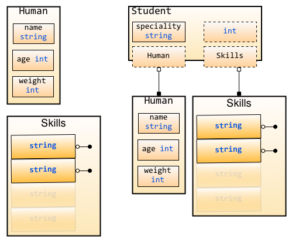

# 2.4 struct 型別
## struct
Go 語言中，也和 C 或者其他語言一樣，我們可以宣告新的型別，作為其它型別的屬性或欄位的容器。例如，我們可以建立一個自訂型別 `person` 代表一個人的實體。這個實體擁有屬性：姓名和年齡。這樣的型別我們稱之`struct`。如下程式碼所示:

```Go
type person struct {
	name string
	age int
}
```
看到了嗎？宣告一個 struct 如此簡單，上面的型別包含有兩個欄位
- 一個 string 型別的欄位 name，用來儲存使用者名稱稱這個屬性
- 一個 int 型別的欄位 age，用來儲存使用者年齡這個屬性

如何使用 struct 呢？請看下面的程式碼

```Go
type person struct {
	name string
	age int
}

var P person  // P 現在就是 person 型別的變量了

P.name = "Astaxie"  // 賦值"Astaxie"給 P 的 name 屬性.
P.age = 25  // 賦值"25"給變數 P 的 age 屬性
fmt.Printf("The person's name is %s", P.name)  // 訪問 P 的 name 屬性.
```
除了上面這種 P 的宣告使用之外，還有另外幾種宣告使用方式：

- 1.按照順序提供初始化值

	P := person{"Tom", 25}

- 2.透過 `field:value` 的方式初始化，這樣可以任意順序

	P := person{age:24, name:"Tom"}

- 3.當然也可以透過 `new` 函式分配一個指標，此處 P 的型別為*person

	P := new(person)

下面我們看一個完整的使用 struct 的例子

```Go
package main

import "fmt"

// 宣告一個新的型別
type person struct {
	name string
	age int
}

// 比較兩個人的年齡，回傳年齡大的那個人，並且回傳年齡差
// struct 也是傳值的
func Older(p1, p2 person) (person, int) {
	if p1.age>p2.age {  // 比較 p1 和 p2 這兩個人的年齡
		return p1, p1.age-p2.age
	}
	return p2, p2.age-p1.age
}

func main() {
	var tom person

	// 賦值初始化
	tom.name, tom.age = "Tom", 18

	// 兩個欄位都寫清楚的初始化
	bob := person{age:25, name:"Bob"}

	// 按照 struct 定義順序初始化值
	paul := person{"Paul", 43}

	tb_Older, tb_diff := Older(tom, bob)
	tp_Older, tp_diff := Older(tom, paul)
	bp_Older, bp_diff := Older(bob, paul)

	fmt.Printf("Of %s and %s, %s is older by %d years\n",
		tom.name, bob.name, tb_Older.name, tb_diff)

	fmt.Printf("Of %s and %s, %s is older by %d years\n",
		tom.name, paul.name, tp_Older.name, tp_diff)

	fmt.Printf("Of %s and %s, %s is older by %d years\n",
		bob.name, paul.name, bp_Older.name, bp_diff)
}
```
### struct 的匿名欄位
我們上面介紹了如何定義一個 struct，定義的時候是欄位名與其型別一一對應，實際上 Go 支援只提供型別，而不寫欄位名的方式，也就是匿名欄位，也稱為嵌入欄位。

當匿名欄位是一個 struct 的時候，那麼這個 struct 所擁有的全部欄位都被隱含的引入了當前定義的這個 struct。

讓我們來看一個例子，讓上面說的這些更具體化

```Go
package main

import "fmt"

type Human struct {
	name string
	age int
	weight int
}

type Student struct {
	Human  // 匿名欄位，那麼預設 Student 就包含了 Human 的所有欄位
	speciality string
}

func main() {
	// 我們初始化一個學生
	mark := Student{Human{"Mark", 25, 120}, "Computer Science"}

	// 我們訪問相應的欄位
	fmt.Println("His name is ", mark.name)
	fmt.Println("His age is ", mark.age)
	fmt.Println("His weight is ", mark.weight)
	fmt.Println("His speciality is ", mark.speciality)
	// 修改對應的備註資訊
	mark.speciality = "AI"
	fmt.Println("Mark changed his speciality")
	fmt.Println("His speciality is ", mark.speciality)
	// 修改他的年齡資訊
	fmt.Println("Mark become old")
	mark.age = 46
	fmt.Println("His age is", mark.age)
	// 修改他的體重資訊
	fmt.Println("Mark is not an athlet anymore")
	mark.weight += 60
	fmt.Println("His weight is", mark.weight)
}
```
圖例如下:



圖 2.7 struct 組合，Student 組合了 Human struct 和 string 基本型別

我們看到 Student 訪問屬性 age 和 name 的時候，就像訪問自己所有用的欄位一樣，對，匿名欄位就是這樣，能夠實現欄位的繼承。是不是很酷啊？還有比這個更酷的呢，那就是 student 還能訪問 Human 這個欄位作為欄位名。請看下面的程式碼，是不是更酷了。

```Go
mark.Human = Human{"Marcus", 55, 220}
mark.Human.age -= 1
```
透過匿名訪問和修改欄位相當的有用，但是不僅僅是 struct 欄位哦，所有的內建型別和自訂型別都是可以作為匿名欄位的。請看下面的例子

```Go
package main

import "fmt"

type Skills []string

type Human struct {
	name string
	age int
	weight int
}

type Student struct {
	Human  // 匿名欄位，struct
	Skills // 匿名欄位，自訂的型別 string slice
	int    // 內建型別作為匿名欄位
	speciality string
}

func main() {
	// 初始化學生 Jane
	jane := Student{Human:Human{"Jane", 35, 100}, speciality:"Biology"}
	// 現在我們來訪問相應的欄位
	fmt.Println("Her name is ", jane.name)
	fmt.Println("Her age is ", jane.age)
	fmt.Println("Her weight is ", jane.weight)
	fmt.Println("Her speciality is ", jane.speciality)
	// 我們來修改他的 skill 技能欄位
	jane.Skills = []string{"anatomy"}
	fmt.Println("Her skills are ", jane.Skills)
	fmt.Println("She acquired two new ones ")
	jane.Skills = append(jane.Skills, "physics", "golang")
	fmt.Println("Her skills now are ", jane.Skills)
	// 修改匿名內建型別欄位
	jane.int = 3
	fmt.Println("Her preferred number is", jane.int)
}
```
從上面例子我們看出來 struct 不僅僅能夠將 struct 作為匿名欄位，自訂型別、內建型別都可以作為匿名欄位，而且可以在相應的欄位上面進行函式操作（如例子中的 append）。

這裡有一個問題：如果 human 裡面有一個欄位叫做 phone，而 student 也有一個欄位叫做 phone，那麼該怎麼辦呢？

Go 裡面很簡單的解決了這個問題，最外層的優先訪問，也就是當你透過`student.phone`訪問的時候，是訪問 student 裡面的欄位，而不是 human 裡面的欄位。

這樣就允許我們去過載透過匿名欄位繼承的一些欄位，當然如果我們想訪問過載後對應匿名型別裡面的欄位，可以透過匿名欄位名來訪問。請看下面的例子

```Go
package main

import "fmt"

type Human struct {
	name string
	age int
	phone string  // Human 型別擁有的欄位
}

type Employee struct {
	Human  // 匿名欄位 Human
	speciality string
	phone string  // 僱員的 phone 欄位
}

func main() {
	Bob := Employee{Human{"Bob", 34, "777-444-XXXX"}, "Designer", "333-222"}
	fmt.Println("Bob's work phone is:", Bob.phone)
	// 如果我們要訪問 Human 的 phone 欄位
	fmt.Println("Bob's personal phone is:", Bob.Human.phone)
}
```

## links
   * [目錄](<preface.md>)
   * 上一章: [流程和函式](<02.3.md>)
   * 下一節: [物件導向](<02.5.md>)
